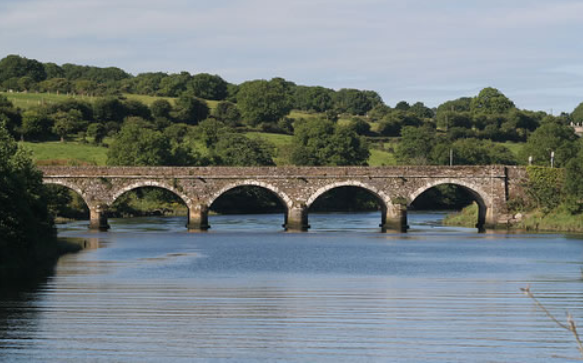
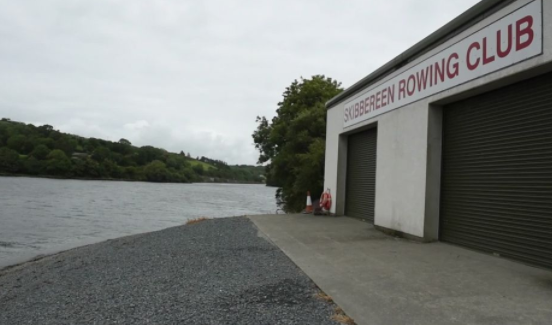
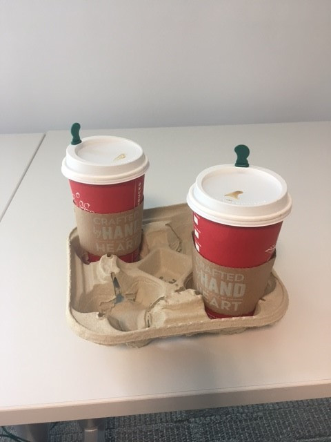

{::options parse_block_html="true" /}

iLen Technology Services is a new and exciting Cork based startup. Our vision is to bring open, secure traceability to the food supply chain, focusing on the dairy industry initially.

Our ‘journey’ to date started on a very wet day trip to Digitialweek in Skibbereen in November 2016. An idea was born between two of the original co-founders, John O’Reilly and Joan O’Sullivan. The idea was to use the emerging technology, Blockchain, to bring transparency to the food supply chain. The food supply chain was beginning to be a flagged as good use case for Blockchain. Together with a user friendly app which would allow the consumer to look at the provenance of a product, the idea behind iLen Tech was born.

The iLen river runs through Skibbereen so we felt it was a great name for our company given that it was beside that river that the initial conversations started. We also felt it if the river has world champion rowers training on it then it matches our ambitions to be a global leader in the agri-food space.

Since last November, we have worked tirelessly on bringing our idea to life. As true IT professionals, the first of many, many brainstorming sessions started with a coffee.

We are focusing on the agri world initially. We have expanded our management team by securing the highly respected Jim Costello as chairman. We have also established an advisory board with deep sectoral knowledge. While the company is very much in its infancy in terms of time in existence, we feel we have the right SMEs to support us with opening the right doors to the agri-food sector.

Check out our short video to demonstrate what we offer.
